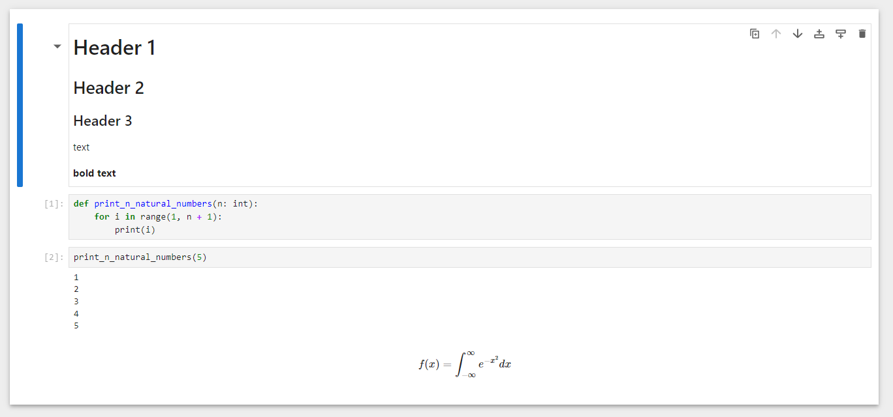

# Interactive development Using Jupyter

## Purpose

These coding exercises are designed to test your knowledge of the following concepts:

* The Python environment
* The Jupyter notebook development environment

## Overview

The coding exercises cover the following practical problems:

* Creating a Python environment
* Using a Jupyter notebook for development

## Coding exercises

### Exercise 1: Create a Python environment

Your task is to install the required dependencies using either `pip` or `conda`. The requirements (`requirements.txt` and `environment.yml`) are located in the root of the repository.

#### Pip installation

```bash
pip install requirements.txt
```

#### Conda installation

```bash
conda env create -f environment.yml
conda activate data-analysis-course
```

Please note that this exercise won't be evaluated; however, you must make sure the environment is installed correctly in order to proceed with the rest of the course.

### Exercise 2: Reproduce a given Jupyter notebook

Your task is to adjust the given notebook (`solution.ipynb`) so that after you click on the button "Restart the kernel and run all cells", it looks exactly like the screenshot below:



NOTE: The notebook should have exactly four cells.
